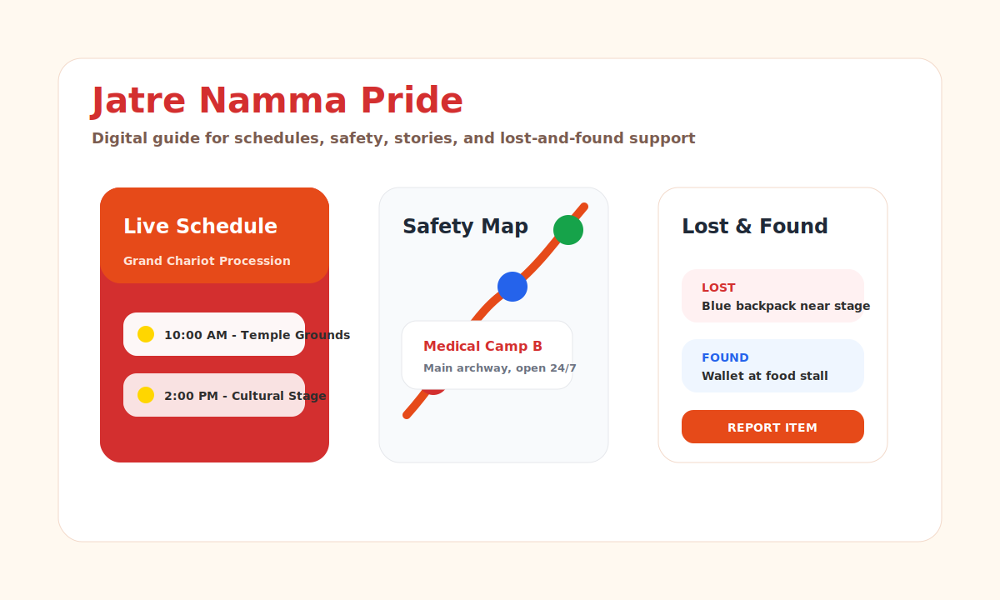

# Jatre Namma Pride

Jatre Namma Pride is a digital companion for village fair visitors. It combines a polished web preview with a native Android app built for event schedules, safety navigation, cultural stories, and lost-and-found reporting.

## Problem Statement

Village fairs can be crowded, fast-moving, and difficult for visitors to navigate. People need one place to check event timings, find safety points, report lost belongings, and learn the cultural story behind the celebration. This project solves that with a visitor-friendly digital guide for local jatre organizers and attendees.

## Features

- Live and upcoming jatre event schedule
- Safety map for parking, first-aid points, and helpdesk locations
- Lost-and-found reporting workflow with item status tracking
- Cultural story section for local heritage
- Kannada and English web preview experience
- Android app structure using Kotlin, Jetpack Compose, Hilt, Firebase, and Maps

## Tech Stack

- React 19, TypeScript, Vite, Tailwind CSS
- Kotlin, Jetpack Compose, Material 3
- Firebase Firestore, Firebase Storage, Firebase Auth
- Google Maps SDK for Android

## Preview



## Web Setup

Prerequisites: Node.js 20 or newer.

```bash
npm install
npm run dev
```

Open the local URL shown by Vite. By default, the dev server uses port `3000`.

## Web Usage

1. Start the web preview with `npm run dev`.
2. Use the bottom navigation to switch between schedule, map, lost-and-found, and stories.
3. Toggle the language button on the home screen to switch between English and Kannada.
4. Add a lost or found item from the lost-and-found screen and mark active items as resolved.

## Android Setup

1. Open the project in Android Studio.
2. Copy `local.properties.example` to `local.properties`.
3. Add your Maps key:

```properties
MAPS_API_KEY=your_google_maps_api_key
```

4. Replace the placeholder Firebase config in `app/google-services.json` with your Firebase project config before building a connected release.

## Folder Structure

```text
.
├── app/                  # Native Android app source
│   └── src/main/java/    # Compose screens, view models, data, domain, and DI layers
├── docs/screenshots/     # README preview assets
├── src/                  # React/Vite web preview
├── package.json          # Web dependencies and scripts
├── build.gradle.kts      # Root Android Gradle config
└── README.md             # Project documentation
```

## Useful Scripts

```bash
npm start
npm run dev
npm run build
npm run typecheck
npm run preview
```

## Build Verification

The web project has been checked with:

```bash
npm run typecheck
npm run build
```

The Android project is structured for Android Studio with Kotlin, Compose, Firebase, and Maps configuration. A local `MAPS_API_KEY` is required in `local.properties` for map-enabled Android builds.

## Future Improvements

- Add organizer login and role-based access for event updates.
- Store lost-and-found photo uploads with stricter moderation fields.
- Add offline caching for event schedules during low-connectivity fair days.
- Publish a hosted web demo after Firebase production configuration is complete.
